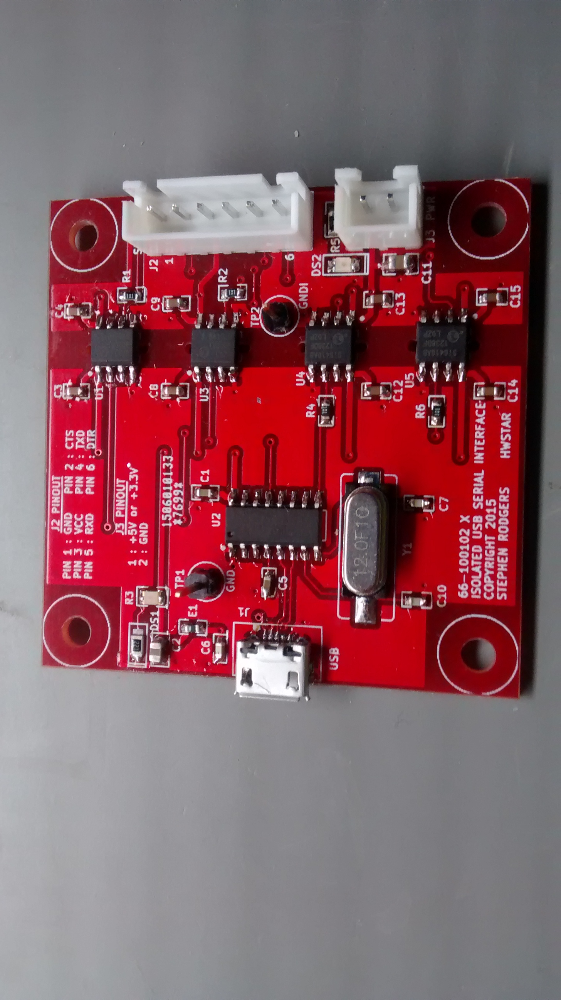
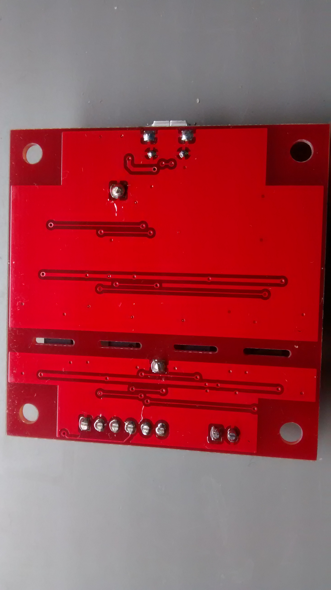

***ISO-port Isolated USB Serial Interface***

This is an isolated USB serial interface implemented with a CH340G USB to serial converter chip
and 4 Silicon Labs SI8410 digital isolators. 

In a standard USB serial interface, the ground coming from your PC is connected to the USB ground,
and connected to the device you are communicating with. If there is a high current
short to ground on the device you are connected to, a large current could flow
though the USB cable which could damage your computer. 

If you need to communicate with some device which is not at the ground used by the PC or
could raise the ground due to large fault currents then you must use some form of isolation
to prevent a large fault current from flowing.

The board has a micro usb type B connector on one end, and a 6 pin 5mm connector and 2 pin 5mm connector 
on the other end. The 2 pin connector can be used to feed in 3.3V or 5V to power the isolated
side of the interface if there is no power coming in on the 6 pin connector. The isolated
side has a red LED to indicate it is powered on. The USB side has a green LED to indicate
the USB cable is plugged in, and USB power is present.  There are slots the PCB underneath 
each Si8410 to help increase the creepage distance. 

Picture of the front of the board:

Picture of the rear of the board:

**EDA Software**

This board was designed using KICAD. 

**Board Size**

5cm x 5cm

**LICENSE**

Creative Commons Attribution Share-Alike license. (CC-BY-SA)

**Disclaimer**

Build and use at your own risk.  

Be safe. Test the isolated serial adapter with appropriate test equipment (such as an Insulation Tester) before connecting it to any high voltage project!

I will not be responsible for any damages including but not limited to: errors or omissions, loss of life, or property damage. You have been warned.

